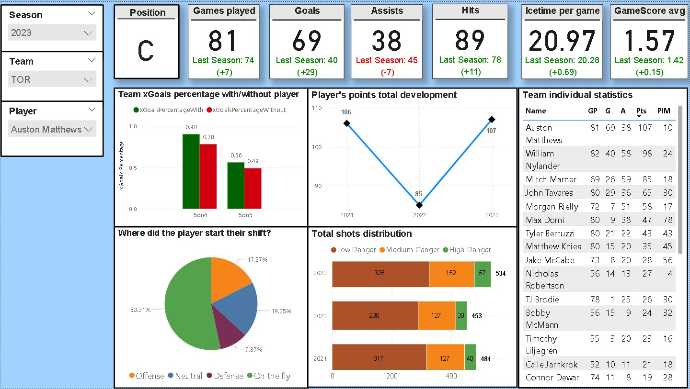

# NHL-dashboard-project

Hello! Welcome to my NHL stats project. This project is part of my Data Analytics portfolio where I aim to showcase my skills with different data analysis tools.

## Goal of this project
- To create easy to use dashboard tool for NHL players stats to show in simple and fast way some key statistics from chosen player, their development in certain metrics and little bit of comparision to other players.

## Skills used in this project
1. Python to manipulate data
2. Power BI to create dashboard that can be used to view key statistics from each player.

## Data
-Data I will be using in this project is originally downloaded from moneypuck.com. I downloaded three consecutive seasons of data, merged the datasets, made some manipulations and used the final dataset in Power BI environment. 

## Contents of this repository
1. Datasets-folder with all the originally downloaded datasets
2. NHL_data_manipulation -notebook with code for changes made to these datasets
3. NHL_dashboard -file with the Power BI file I created
4. dashboard_example -image with the picture showed above, showing the example of how the dashboard looks like

## Dashboard contents and why they were chosen
1. Filters
   - Three different dropdown-filters for easy and fast navigation across seasons, teams and players.
2. KPIs
   - I chose some of my favourite individual stats to show in KPI-format. These statistics hopefully show viewer the overall statistics and they get fast idea about player's performance for that season
   - KPIs: Position, Games played, Goals, Assists, Hits, Ice time average and GameScore average
   - Underneath each stat is comparision to previous season to show their season to season development in these KPIs. The colour changes based on if player has improved in the metric or not.
3. Team xGoalsPercentage with/without
   -Aim with this plot was to showcase easily if the team performs better with the player on ice vs without player on ice in terms of xGoalsPercentage. If the green barr is bigger than red bar, team played better with the player on ice.
   - There are 2 categories for these bars: 5v5 and 5v4. This is to show little bit of comparision between different game situations and how it affects the xGoalsPercentage
4. Where did the player start their shift?
   - This plot aims to show how the player is deployed in the game. For example, the bigger the slice is for defensive, the more defensive minded player we have. This should be taken into consideration when comparing scoring between players.
5. Player's points total development
   - How has the goals+assists total developed? Simple plot to show trends for player.
6. Total shots distribution
   - Shows how many shots the player has taken each season and how those are distributed between different levels of threat.
7. Team individual statistics
   - Fast tool to scroll through each player in the team and sort them based on the few key stats.
  
## Final thoughts
- This was fun project where I really got to challenge myself and build product that I could see myself using to quickly evaluate player's performance
- There were challenges along the way and some of them are still unsolved.
- This was merely a first edition for this type of dashboard and I aim to make it even better in the future and include more interesting plots.
